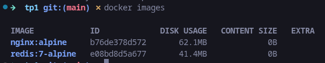

# TP1 : Manipulation des Conteneurs

## Contexte

Vous venez d'être embauché comme DevOps junior dans une startup. Votre première mission est de démontrer votre maîtrise des commandes Docker de base en manipulant des conteneurs.

---

## Exercice 1 : Premiers pas

### 1.1 Vérification de l'installation 

Affichez la version de Docker installée et notez-la dans votre fichier de réponses.

**Commande attendue :**

```bash
docker -v
Docker version 29.2.0, build 1.fc43
```

### 1.2 Téléchargement d'images 

Téléchargez les images suivantes :
- `nginx:alpine`
- `redis:7-alpine`

**Questions :**

- Quelle est la taille de chaque image ?
```bash
La taille de nginx:alpine est de 62.1MB
et celle de redis:7-alpine est de 41.4MB
```

- Pourquoi utilise-t-on des images `alpine` ?
```bash
    On les utilisent car elles sont plus légères
```


### 1.3 Liste des images 

Affichez la liste de toutes les images présentes sur votre système.

**Questions :**

- Quelle commande avez-vous utilisée ?
```bash
    docker images
```
- Combien d'images sont présentes ?


Donc 2 images ici

---

## Exercice 2 : Gestion des conteneurs 

### 2.1 Lancer un conteneur Nginx 

Lancez un conteneur Nginx avec les caractéristiques suivantes :
- Nom : `web-eval`
- Mode détaché
- Port 8080 de l'hôte mappé vers le port 80 du conteneur

**Vérification :** Accédez à `http://localhost:8080` dans votre navigateur.
```bash
docker run -d --name web-eval -p 8080:80 nginx:alpine
```
### 2.2 Inspection du conteneur 

Répondez aux questions suivantes sur le conteneur `web-eval` :
- Quelle est son adresse IP ?
```bash
docker inspect -f '{{range.NetworkSettings.Networks}}{{.IPAddress}}{{end}}' web-eval
172.17.0.2
```
- Quel est son état (status) ?
```bash
docker inspect -f '{{.State.Status}}' web-eval
running
```
- Quand a-t-il été créé ?
```bash
docker inspect -f '{{.Created}}' web-eval
2026-02-09T09:25:32.900767929Z

```

### 2.3 Logs et processus 

- Affichez les 10 dernières lignes de logs du conteneur
```bash
~ docker logs --tail 10 web-eval 
2026/02/09 09:25:33 [notice] 1#1: start worker process 31
2026/02/09 09:25:33 [notice] 1#1: start worker process 32
2026/02/09 09:25:33 [notice] 1#1: start worker process 33
2026/02/09 09:25:33 [notice] 1#1: start worker process 34
2026/02/09 09:25:33 [notice] 1#1: start worker process 35
2026/02/09 09:25:33 [notice] 1#1: start worker process 36
2026/02/09 09:25:33 [notice] 1#1: start worker process 37
172.17.0.1 - - [09/Feb/2026:09:26:05 +0000] "GET / HTTP/1.1" 200 615 "-" "Mozilla/5.0 (X11; Linux x86_64) AppleWebKit/537.36 (KHTML, like Gecko) Chrome/144.0.0.0 Safari/537.36" "-"
2026/02/09 09:26:05 [error] 30#30: *1 open() "/usr/share/nginx/html/favicon.ico" failed (2: No such file or directory), client: 172.17.0.1, server: localhost, request: "GET /favicon.ico HTTP/1.1", host: "localhost:8080", referrer: "http://localhost:8080/"
172.17.0.1 - - [09/Feb/2026:09:26:05 +0000] "GET /favicon.ico HTTP/1.1" 404 555 "http://localhost:8080/" "Mozilla/5.0 (X11; Linux x86_64) AppleWebKit/537.36 (KHTML, like Gecko) Chrome/144.0.0.0 Safari/537.36" "-"
```
- Affichez les processus en cours d'exécution dans le conteneur
```bash
➜  ~ docker top web-eval
UID                 PID                 PPID                C                   STIME               TTY                 TIME                CMD
root                80848               80825               0                   10:25               ?                   00:00:00            nginx: master process nginx -g daemon off;
101                 80976               80848               0                   10:25               ?                   00:00:00            nginx: worker process
101                 80977               80848               0                   10:25               ?                   00:00:00            nginx: worker process
101                 80978               80848               0                   10:25               ?                   00:00:00            nginx: worker process
101                 80979               80848               0                   10:25               ?                   00:00:00            nginx: worker process
101                 80980               80848               0                   10:25               ?                   00:00:00            nginx: worker process
101                 80981               80848               0                   10:25               ?                   00:00:00            nginx: worker process
101                 80982               80848               0                   10:25               ?                   00:00:00            nginx: worker process
101                 80983               80848               0                   10:25               ?                   00:00:00            nginx: worker process
```
### 2.4 Exécution de commandes 

Exécutez les actions suivantes dans le conteneur `web-eval` :
1. Ouvrez un shell interactif
2. Créez un fichier `/tmp/evaluation.txt` contenant votre nom
3. Vérifiez que le fichier existe
4. Quittez le shell
```bash
docker exec -it web-eval sh
echo "Pierre Delavigne" > /tmp/evaluation.txt
ls -l /tmp/evaluation.txt
cat /tmp/evaluation.txt
exit
```
---

## Exercice 3 : Cycle de vie 

### 3.1 Arrêt et redémarrage 

- Arrêtez le conteneur `web-eval`
- Vérifiez qu'il est bien arrêté
- Redémarrez-le
- Vérifiez que le fichier `/tmp/evaluation.txt` existe toujours
```bash
docker stop web-eval
docker ps
docker ps -a
docker start web-eval
docker ps #verifier qu'il tourne
docker exec web-eval cat /tmp/evaluation.txt
```
**Question :** Le fichier existe-t-il toujours ? Pourquoi ?
```bash
OUI, il existe toujours, car c'est le même conteneur qui est redémarré. On ne l'a pas supprimé, juste stopper et redémarrer.
De plus, c'est dans le conteneur que l'on a écrit. Attention cependant si on recrée un nouveau conteneur, le fichier ne sera plus là sauf si on fait un volume.
```
### 3.2 Création d'un conteneur Redis 

Lancez un conteneur Redis avec :
- Nom : `cache-eval`
- Mode détaché
- Pas de mapping de port
```bash
docker run -d --name cache-eval redis:7-alpine
```
Connectez-vous au CLI Redis et exécutez :
```bash
~ docker exec -it cache-eval redis-cli

127.0.0.1:6379> SET evaluation "reussie"
OK
127.0.0.1:6379> GET evaluation
"reussie"
127.0.0.1:6379> 

```

```
SET evaluation "reussie"
GET evaluation
```

### 3.3 Gestion multiple 

- Listez tous les conteneurs (actifs et inactifs)
- Arrêtez tous les conteneurs en une seule commande
- Supprimez tous les conteneurs arrêtés en une seule commande
```bash
docker ps -a
docker stop $(docker ps -q) #pour arreter les conteneurs
docker rm $(docker ps -aq) #pour supprimer les conteneurs

```

**Questions :**
- Quelles commandes avez-vous utilisées ?
```bash
docker ps -a # pour lister tous les conteneurs
docker system prune --all # a été utilisé car le TP ne créait que des conteneurs temporaires sans volumes persistants ni réseaux personnalisés, ce qui rendait le nettoyage sans impact fonctionnel.
```
- Quelle est la différence entre `docker stop` et `docker rm` ?
```bash
docker stop => arrête le conteneur (il existe toujours, peut être redémarré) alors que docker rm lui supprime le conteneur(perd son filesystem interne, sauf volumes)
```
---

## Exercice 4 : Volumes et persistance 

### 4.1 Création d'un volume 
Créez un volume Docker nommé `data-eval`.
```bash
docker volume create data-eval

```

### 4.2 Utilisation du volume 

Lancez un conteneur `alpine` qui :
- Monte le volume `data-eval` sur `/data`
- Crée un fichier `/data/persistant.txt` avec du contenu
- Se termine après exécution
```bash
docker run --rm -v data-eval:/data alpine sh -lc 'echo "donnees persistantes" > /data/persistant.txt && cat /data/persistant.txt'

```
### 4.3 Vérification de la persistance 

- Lancez un nouveau conteneur `alpine` montant le même volume
- Vérifiez que le fichier `persistant.txt` existe et contient les données
```bash
docker run --rm -v data-eval:/data alpine sh -lc 'ls -l /data && cat /data/persistant.txt'

```
**Question :** Expliquez pourquoi les données persistent entre les conteneurs.
```bash
Le volume data-eval est un stockage Docker séparé du conteneur :
le conteneur peut être supprimé, le volume lui reste, donc les fichiers restent accessibles par tout conteneur qui le monte.
```
---

## Nettoyage

À la fin du TP, nettoyez votre environnement :
```bash
docker rm -f web-eval cache-eval
docker volume rm data-eval
```

